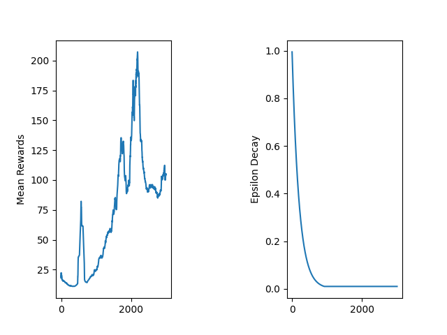
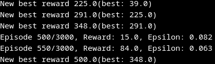
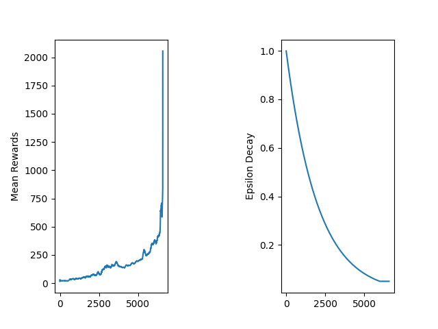
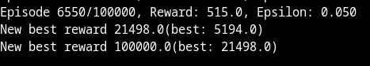

# How to train an AI to learn to play a game?

To do that, we now use Reinforcement Learning. Reinforcement learning already existed in 1950. But it's in 2013 that Reinforcement Learning became well known after Deep Mind succesifully implement Deep Learning in Reinforcement Learning, thanks to that their agent was able to play all the attari game and with better results than humans. Todal will try to do the same thing withthe game Flappy Bird. 

To do it :
- What is Reinforcement Learning
    - Optimizing rewards
    - Policy research
    - Evaluating actions
- Techniques
    -  Policy gradient method
    -  Deep-Q-Networks
    -  Markov Decision Processes
- Our Project
    - Cart Pole V1 as a test
    - Lets implement it for Flappy Bird !

## What is Reinforcement Learning

### Rewards

In reinforcement learning, an agent operates in an environment and, based on its observations, learns to take beneficial actions. The goal is to maximize cumulative reward over time.

For example, consider a robot tasked with reaching a certain location. It receives a positive reward when it successfully moves toward the goal and a negative reward (penalty) when it fails to walk or moves away from the target.

Reinforcement learning is widely applied across many domains, including robotics, integrated systems, and finance.

### Policy Search

The algorithm that an agent uses to determine its actions is called a **policy**. For instance, this policy can be a neural network that takes observations as input and outputs the action to execute.

In this repository, we focus on neural networks because they represent the intersection of reinforcement learning and deep learning, a more recent and powerful approach. There are several techniques for policy search, including brute force, genetic algorithms, and gradient-based methods.

Consider a robot with the ability to rotate. If the robot has a probability $p$ of turning right and a rotation angle ranging from $-r$ to $r$, we have two parameters: $p$ and $r$. The goal is to find the optimal policy and parameter values that maximize overall performance.

To maximize rewards, we can use **gradient ascent**, a method also known as **policy gradient**. This technique iteratively adjusts the policy parameters in the direction that increases expected reward.

#### Policy with Neural Networks

Our neural network must be structured as follows. We start with a vector of observations $(x\_1, x\_2, x\_3, x\_4)$ that represent different aspects of the environment. For example, if you are at a restaurant, these values could represent presentation, taste, price, and service quality. These observations form the input layer of the neural network.

The network then passes through hidden layers, where computations occur. Finally, the output layer represents the policy, the probability of taking a particular action. For a binary decision (e.g., order the meal or not), there is one output neuron. However, you could also have multiple outputs, such as 10 different meal options, where the highest probability determines the action taken.

The neural network is trained through experience. Over time, the agent learns to assign higher probabilities to actions that resulted in greater rewards. For instance, if you enjoyed a meal, the network learns to increase the probability of ordering it again in similar situations.

### Evaluating Actions

The agent only receives feedback from the environment in the form of rewards, which are typically sparse and delayed. Consider the CartPole game in OpenAI Gym, where the goal is to balance a pole on a moving cart. If the agent fails, which action was responsible for the failure? This is known as the credit assignment problem.

To resolve this issue, we evaluate actions by considering all subsequent rewards using a discount factor $\gamma$. The cumulative reward at time $t$ is calculated as the sum of all future "raw" rewards, each weighted by the discount factor raised to increasing powers.

Initially, we might write:

$$R_t = \gamma \cdot w_t + \gamma \cdot w_{t+1} + \gamma \cdot w_{t+2} + \dots$$

However, to give more importance to immediate rewards (since they are more reliable and certain), we apply increasing powers of the discount factor:

$$R_t = \gamma^0 \cdot w_t + \gamma^1 \cdot w_{t+1} + \gamma^2 \cdot w_{t+2} + \dots$$

This can be expressed more compactly as:

$$R_t = \sum_{k=0}^{n} \gamma^k \cdot w_{t+k}$$

The discount factor $\gamma$ typically ranges from 0 to 1. A value close to 1 means the agent values future rewards almost equally to immediate rewards, while a value close to 0 makes the agent prioritize immediate rewards. This approach ensures that recent decisions are held more accountable for their outcomes, helping to solve the credit assignment problem. generally the value is between 0.95 and 0.99.
- for $\gamma$ = 0.95 : 0.95^13 more or less 0.5 (rewards beyond the 13 step worth for 50%)
- for $\gamma$ = 0.99 : 0.99^69 more or less  0.5 (rewards beyond the 69 step worth for 50%)

## Techniques

### Policy Gradient Method

As mentioned previously, policy gradient algorithms optimize the policy parameters by following the direction of steepest ascent in the gradient. One of the most well-known algorithms is REINFORCE, presented by Ronald Williams in 1992.

Here is a variant of the basic REINFORCE algorithm:

1. **Collect trajectories**: The agent plays through several episodes while computing the gradient for each action. These gradients are stored but not yet applied to update the policy.

2. **Compute returns**: After collecting multiple episodes, we calculate the cumulative return (discounted future reward) for each action taken.

3. **Apply gradient updates**: For each action:
   - If the return is positive, we apply the gradient to increase the probability of that action.
   - If the return is negative, we apply the opposite of the gradient to decrease the probability of that action.

4. **Update policy**: Finally, we compute the average of all gradients weighted by their returns and use this to perform a gradient ascent step, updating the policy parameters.

This approach allows the algorithm to learn which actions lead to favorable outcomes and adjust the policy accordingly.

### Markov Decision Processes (MDP)

At the beginning of the 20th century, Andrey Markov studied stochastic processes with no memory, which are named Markov chains. Such a process has a fixed number of states and defined transition probabilities between them. Importantly, the probability of transitioning from one state to another depends only on the current state, not on the history of previous states.

Consider a simple example with two states, E and A. If we start at state E, we have a 30% probability of remaining in E and a 70% probability of transitioning to state A. Once in state A, we have a 60% probability of staying in A and a 40% probability of returning to E.

Markov Decision Processes were formally described for the first time by Richard Bellman in the 1950s. An MDP extends the concept of a Markov chain by allowing an agent to take actions in each state. The transition probabilities depend on both the current state and the action chosen by the agent. Additionally, transitions between states may provide rewards to the agent. The goal is to find a policy that maximizes the cumulative reward over time.

In other words, while a Markov chain is a passive system where transitions occur with fixed probabilities, an MDP is an interactive system where an agent makes decisions and receives feedback in the form of rewards or penalties, enabling learning and optimization.

Consider the example above, which has 3 states and at most 2 discrete actions. Starting from state $S_0$, the agent can choose between:
- Action $a_1$: 100% probability of transitioning to $S_2$
- Action $a_0$: 50% probability of staying in $S_0$, 50% probability of transitioning to $S_2$

Additionally, the agent receives a reward of +5 when choosing action $a_0$ from state $S_1$.

#### Bellman Optimality Equation

Bellman discovered a way to estimate the optimal state value for every state, denoted $V^*(s)$. This represents the maximum cumulative reward (discounted over time) that an agent can expect to obtain starting from that state, assuming optimal decision-making.

When the agent acts optimally, the Bellman Optimality Equation applies:

$$V^{*}(s) = \max_{a} \sum_{s'} T(s,a,s')[R(s,a,s') + \gamma \cdot V^{*}(s')]$$

Where:
- $T(s,a,s')$ is the probability of transitioning from state $s$ to state $s'$ when taking action $a$
- $R(s,a,s')$ is the reward obtained from this transition
- $\gamma$ is the discount factor

#### Value Iteration Algorithm

This equation directly leads to a computational algorithm. We initialize all value estimates to 0 and iteratively update them using the Value Iteration method:

$$V_{k+1}(s) = \max_{a} \sum_{s'} T(s,a,s')[R(s,a,s') + \gamma \cdot V_{k}(s')]$$

By repeating this update, the values converge to the optimal values $V^*(s)$.

#### Q-Learning and Optimal Policy

While knowing the optimal state values is useful, we also need the optimal action-value function, denoted $Q^*(s,a)$. This represents the expected cumulative reward when starting at state $s$, taking action $a$, and following the optimal policy thereafter.

The Q-value iteration is:

$$Q_{k+1}(s,a) = \sum_{s'} T(s,a,s')[R(s,a,s') + \gamma \cdot \max_{a'} Q_{k}(s',a')]$$

Once we have the optimal Q-values, we can define the optimal policy as:

$$\pi^{*}(s) = \text{argmax}_{a} Q^{*}(s,a)$$

This policy tells the agent which action to take in each state to maximize cumulative reward. By following this policy, the agent achieves optimal performance in the MDP.

### DeepQ Networks
#### Model-Free Learning

At the beginning, the agent has no knowledge of the transition probabilities $T(s,a,s')$ or the reward function $R(s,a,s')$. It must explore the environment and test each transition at least once to estimate the expected rewards. This is fundamentally different from the value iteration algorithm, which assumes complete knowledge of the environment dynamics.

#### Temporal Difference Learning

Temporal Difference (TD) Learning is an algorithm similar to value iteration but designed for the model-free setting. At the start, the agent follows an exploration policy that randomly samples actions to discover the environment. Over time, the agent accumulates experience and learns to estimate state values without knowing the true transition probabilities.

The state value update rule is:

$$V_{k+1}(s) = (1-\alpha)V_{k}(s) + \alpha \left( r + \gamma \cdot V_{k}(s') \right)$$

Where:
- $\alpha$ is the learning rate, determining how much the new experience influences the estimate
- $r$ is the immediate reward received
- $\gamma$ is the discount factor
- $V_k(s')$ is the estimated value of the next state

This approach "bootstraps" by using the current estimate of the next state value to update the current state value.

#### Q-Learning

Using the same principle, the Q-Learning algorithm learns state-action values:

$$Q_{k+1}(s,a) = (1-\alpha)Q_{k}(s,a) + \alpha \left( r + \gamma \cdot \max_{a'} Q_{k}(s',a') \right)$$

With a sufficient number of iterations, the Q-values converge to the optimal values $Q^*(s,a)$, guaranteeing that the derived policy is optimal.

Q-Learning is an off-policy algorithm, meaning it learns an optimal policy while following a different exploration policy during training. The agent can explore the environment with one strategy while learning the optimal greedy policy in the background.

#### Exploration Strategy: Epsilon-Greedy

Q-Learning requires sufficient exploration of the Markov Decision Process to discover high-value regions. Without adequate exploration, the agent may converge prematurely to suboptimal solutions.

A practical approach is the epsilon-greedy strategy. The agent selects a random action with probability $\epsilon$ and the greedy action (highest Q-value) with probability $1-\epsilon$. This ensures consistent exploration of the state-action space while gradually exploiting the most promising actions.

With exploration bonuses, the update rule becomes:

$$Q(s,a) = (1-\alpha)Q(s,a) + \alpha \left( r + \gamma \cdot \max_{a'} f(Q(s',a'), N(s',a')) \right)$$

Where:
- $N(s',a')$ is the number of times action $a'$ has been selected in state $s'$
- $f(Q, N)$ is an exploration function that adds a bonus for rarely-visited state-action pairs

A common exploration function is $f(Q, N) = Q + \frac{c}{\sqrt{N}}$, which decreases the bonus as actions are visited more frequently.

#### Deep Q-Learning (DQN)

Deep Q-Networks (DQN) extend Q-Learning to high-dimensional state spaces by using neural networks to approximate Q-values. Instead of maintaining a table of Q-values for every state-action pair, the network learns a function $Q_\theta(s,a)$ parameterized by weights $\theta$.

##### Training Deep Q-Networks

For a given state-action pair $(s,a)$, the network's prediction $Q_\theta(s,a)$ should approximate the target value according to the Bellman equation:

$$y(s,a) = r + \gamma \max_{a'} Q_\theta(s',a')$$

Where $y(s,a)$ is the target value combining:
- The immediate reward $r$
- The discounted maximum Q-value of the next state $s'$

To train the network, we minimize the loss between the prediction and the target:

$$\mathcal{L}(\theta) = \left( Q_\theta(s,a) - y(s,a) \right)^2$$

We update the network weights using gradient descent to reduce this loss.

DeepMind introduced two key innovations to stabilize and improve DQN training:

1. **Experience Replay**: Instead of learning from transitions sequentially, the agent stores experiences in a buffer and samples random minibatches for training. This decorrelates the sequential nature of experience, reducing instability and improving sample efficiency.

2. **Double DQN**: The original DQN tends to overestimate Q-values because it uses the same network to select and evaluate actions. Double DQN maintains a separate target network that periodically updates from the main network. This decoupling significantly reduces overestimation bias and leads to more stable learning.

These modifications transformed DQN into a practical algorithm capable of learning complex control policies from raw pixel inputs.

## Our project

### A start with CartPole V1
#### Implementation

To validate our understanding of DQN, we implement a complete agent with experience replay to solve the CartPole environment. In this section, we discuss the architecture, hyperparameters, and results of our implementation.

#### Agent

##### Initialization

The agent is initialized with hyperparameters loaded from a configuration file (hyperparameters.yml). These include:
- Network architecture parameters (hidden dimensions, learning rate)
- Training parameters (learning rate, discount factor $\gamma$, epsilon decay)
- Experience replay parameters (buffer size, mini-batch size)
- Synchronization rate for the target network

We also initialize data structures to track:
- Training metrics (loss, rewards per episode)
- Analysis and visualization tools for monitoring performance

The loss function is set to Mean Squared Error (MSE), and we use the Adam optimizer for gradient updates.

##### Run Function

The main training loop follows this structure:

1. **Initialize environment**: We set up a Gymnasium environment for CartPole and track episode rewards.

2. **Training setup**: If in training mode:
   - Initialize the experience replay buffer
   - Set the initial $\epsilon$ value for epsilon-greedy exploration
   - Prepare the policy and target networks

3. **Episode loop**: For each episode:
   - Reset the environment and play until termination or max steps
   - At each step:
     - Select an action using epsilon-greedy: with probability $\epsilon$, choose randomly; otherwise, use the DQN to select the greedy action
     - Execute the action and observe the new state and reward
     - Store the transition $(s, a, r, s')$ in the experience replay buffer
   
4. **Model update**: After collecting a mini-batch of experiences:
   - Call the optimization function to update the policy network
   - Periodically synchronize the target network
   - Decay $\epsilon$ to reduce exploration over time

5. **Logging and visualization**: Track rewards and loss at the end of each episode

##### Optimization Function

The optimization function performs one training step:

1. Sample a random mini-batch from the experience replay buffer
2. Compute the target Q-values using the Bellman equation
3. Compute the loss (MSE) between the policy network predictions and targets
4. Perform backpropagation and update the policy network weights using Adam optimizer

##### Saving Results

After training completes, we generate and save:
- Training loss curves
- Episode reward history
- These visualizations help analyze convergence and identify training issues

#### DQN Architecture

The Deep Q-Network is a feedforward neural network that approximates Q-values.

##### Initialization

The network requires:
- **Input dimension** (state_dim): The size of the state observation (e.g., 4 for CartPole: position, velocity, angle, angular velocity)
- **Output dimension** (action_dim): The number of possible actions (e.g., 2 for CartPole: left or right)
- **Hidden dimension** (hidden_dim): A hyperparameter controlling network capacity (e.g., 128, 256)

##### Architecture

The network consists of:
- Input layer: fully connected, takes state observations
- Hidden layer(s): fully connected with **ReLU activation** function, providing non-linearity
- Output layer: fully connected, outputs Q-values for each action

The ReLU activation function is defined as:
$$f(x) = \max(0, x)$$

This introduces non-linearity while being computationally efficient.

##### Forward Pass

During the forward pass, input states are propagated through the network:
1. State enters the first hidden layer
2. ReLU activation is applied
3. Output layer produces Q-values for all actions
4. The Q-value corresponding to the taken action is used for loss computation

#### Experience Replay Buffer

The experience replay buffer is a fixed-size circular queue that stores experiences.

##### Functionality

- **Storage**: New experiences (transitions) are appended to the buffer. When full, old experiences are overwritten.
- **Sampling**: A random sample of experiences is retrieved from the buffer, breaking correlations between consecutive samples.
- **Size**

#### Hyperparameters and Results

##### First Attempt: Initial Configuration

We began with a discount factor of $\gamma = 0.99$ to give substantial weight to future rewards accumulated throughout an episode. The epsilon-greedy strategy was configured with:
- epsilon_decay: 0.995: Decay the exploration parameter after each episode
- epsilon_min: 0.01: Maintain a minimum of 1% random action selection to prevent convergence to suboptimal policies
- Total training episodes: 5,000

**Results:**

The agent achieved several successful episodes with rewards approaching 500, with an average batch reward of around 200. However, performance was unstable and periodically collapsed to rewards as low as 100. This instability suggests that the exploration-exploitation balance was not optimal.

##### Second Attempt: Improved Configuration

To address these issues, we adjusted the hyperparameters:
- epsilon_decay: 0.9995: Slower decay rate, allowing longer exploration phases
- epsilon_min: 0.05: Increased minimum exploration to 5% to maintain behavioral diversity
- Extended training to discover more robust solutions

**Results:**

The second configuration demonstrated significantly better performance. The slower epsilon decay allowed the agent more time to explore the state space and learn diverse strategies. Maintaining higher minimum exploration (5%) prevented the policy from becoming too greedy too early. The results show:
- High rewards
- Fewer catastrophic failures after convergence

### Lets train our model for Flappy bird

#### normal DQN deceiving results
